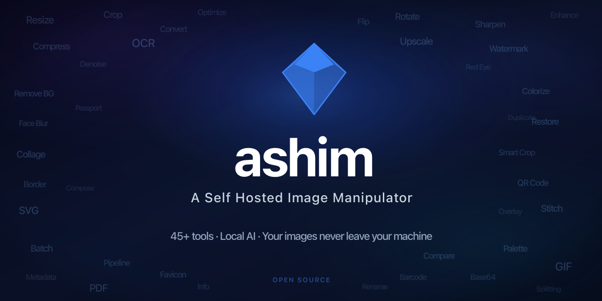
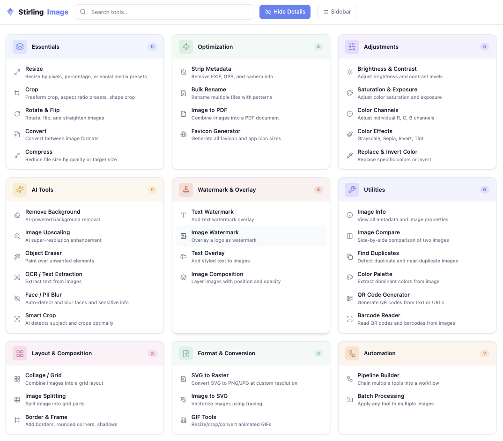

<p align="center">
  
</p>

<p align="center">
  <a href="https://hub.docker.com/r/snapotter/snapotter"></a>
  <a href="https://github.com/orgs/snapotter-hq/packages/container/package/snapotter"></a>
  <a href="https://github.com/snapotter-hq/snapotter/actions"></a>
  <a href="https://github.com/snapotter-hq/snapotter/blob/main/LICENSE"></a>
  <a href="https://github.com/snapotter-hq/snapotter/stargazers"></a>
  <a href="https://discord.gg/hr3s7HPUsr"></a>
</p>



## Key Features

- **48 image tools** - Resize, crop, compress, convert, watermark, color adjust, vectorize, create GIFs, find duplicates, generate passport photos, and more
- **Local AI** - Remove backgrounds, upscale images, restore and colorize old photos, erase objects, blur faces, enhance faces, extract text (OCR). All on your hardware - no internet required
- **Pipelines** - Chain tools into reusable workflows with unlimited steps. Batch process unlimited images at once
- **REST API** - Every tool available via API with API key auth. Interactive docs at `/api/docs`
- **Single container** - One `docker run`, no Redis, no Postgres, no external services
- **Multi-arch** - Runs on AMD64 and ARM64 (Intel, Apple Silicon, Raspberry Pi)
- **Privacy first** - Your images never leave your machine. SnapOtter asks once whether you'd like to share anonymous product analytics (which tools are used, errors encountered — never file data). Change anytime in Settings, or set `ANALYTICS_ENABLED=false` to disable completely

## Quick Start

```bash
docker run -d --name snapotter -p 1349:1349 -v snapotter-data:/data snapotter/snapotter:latest
```

<details>
<summary><sub>Have an NVIDIA GPU? Click here for GPU acceleration.</sub></summary>
<br>

Add `--gpus all` for GPU-accelerated background removal, upscaling, and OCR:

```bash
docker run -d --name snapotter -p 1349:1349 --gpus all -v snapotter-data:/data snapotter/snapotter:latest
```

> Requires an NVIDIA GPU and [Container Toolkit](https://docs.nvidia.com/datacenter/cloud-native/container-toolkit/latest/install-guide.html). Falls back to CPU if no GPU is found. See [Docker Tags](https://docs.snapotter.com/guide/docker-tags) for benchmarks and Docker Compose examples.

</details>

**Default credentials:**

| Field    | Value   |
|----------|---------|
| Username | `admin` |
| Password | `admin` |

You will be asked to change your password on first login.

For Docker Compose, persistent storage, and other setup options, see the [Getting Started Guide](https://docs.snapotter.com/guide/getting-started). For GPU acceleration and tag details, see [Docker Tags](https://docs.snapotter.com/guide/docker-tags).

## Documentation

- [Getting Started](https://docs.snapotter.com/guide/getting-started)
- [Configuration](https://docs.snapotter.com/guide/configuration)
- [Deployment](https://docs.snapotter.com/guide/deployment)
- [Docker Tags](https://docs.snapotter.com/guide/docker-tags)
- [REST API](https://docs.snapotter.com/api/rest)
- [AI Engine](https://docs.snapotter.com/api/ai)
- [Image Engine](https://docs.snapotter.com/api/image-engine)
- [Architecture](https://docs.snapotter.com/guide/architecture)
- [Database](https://docs.snapotter.com/guide/database)
- [Developer Guide](https://docs.snapotter.com/guide/developer)
- [Contributing](https://docs.snapotter.com/guide/contributing)
- [Translation Guide](https://docs.snapotter.com/guide/translations)

## Feedback

Found a bug or have a feature idea? Open a [GitHub Issue](https://github.com/snapotter-hq/snapotter/issues). We don't accept pull requests, but your feedback directly shapes the project. See [CONTRIBUTING.md](CONTRIBUTING.md) for details.

Join our [Discord](https://discord.gg/hr3s7HPUsr) for help, discussion, and community updates.

## License

This project is dual-licensed under the [AGPLv3](LICENSE) and a commercial license.

- **AGPLv3 (free):** You may use, modify, and distribute this software under the AGPLv3. If you run a modified version as a network service, you must make your source code available under the AGPLv3. This applies to personal use, open-source projects, and any use that complies with AGPLv3 terms.
- **Commercial license (paid):** For use in proprietary software or SaaS products where AGPLv3 source-disclosure is not suitable, a commercial license is available. [Contact us](mailto:contact@snapotter.com) for pricing and terms.
