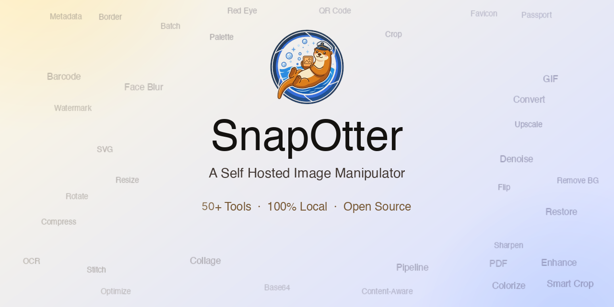

<p align="center">
  
</p>

<p align="center">
  <a href="https://hub.docker.com/r/snapotter/snapotter"></a>
  <a href="https://github.com/orgs/snapotter-hq/packages/container/package/snapotter"></a>
  <a href="https://github.com/snapotter-hq/snapotter/actions"></a>
  <a href="https://www.bestpractices.dev/projects/12881"></a>
  <a href="https://github.com/snapotter-hq/snapotter/blob/main/LICENSE"></a>
  <a href="https://github.com/snapotter-hq/snapotter/stargazers"></a>
  <a href="https://demo.snapotter.com"></a>
  <a href="https://discord.gg/hr3s7HPUsr"></a>
  <a href="https://github.com/sponsors/snapotter-hq"></a>
</p>


## Key Features

- **52 image tools:** Resize, crop, compress, convert, watermark, color adjust, beautify screenshots, generate memes, vectorize, create GIFs, find duplicates, generate passport photos, and more. Supports 55+ input formats (including 23 camera RAW formats) and 14 output formats
- **Image editor:** Layer-based editor with brushes, shapes, adjustments, filters, curves, and keyboard shortcuts. Runs in your browser, processes on your hardware
- **Local AI:** Remove backgrounds, upscale images, restore and colorize old photos, erase objects, blur faces, enhance faces, extract text (OCR), expand canvas, fix transparency. All on your hardware, no internet required
- **OIDC / SSO:** Login with Google, GitHub, Okta, or any OpenID Connect provider
- **20 languages:** Arabic, Chinese, Czech, Dutch, French, German, Hindi, Indonesian, Italian, Japanese, Korean, Polish, Portuguese, Russian, Spanish, Thai, Turkish, Ukrainian, Vietnamese. RTL support for Arabic
- **Pipelines:** Chain tools into reusable workflows with unlimited steps. Import/export as JSON. Batch process unlimited images at once
- **REST API:** Every tool available via API with API key auth. Interactive docs at `/api/docs`
- **Single container:** One `docker run`, no Redis, no Postgres, no external services
- **Multi-arch:** Runs on AMD64 and ARM64 (Intel, Apple Silicon, Raspberry Pi)
- **Privacy first:** Your images never leave your network. SnapOtter asks once whether you'd like to share anonymous product analytics (which tools are used, errors encountered, never file data). Change anytime in Settings, or set `ANALYTICS_ENABLED=false` to disable completely

## Quick Start

```bash
docker run -d --name snapotter -p 1349:1349 -v snapotter-data:/data snapotter/snapotter:latest
```

<details>
<summary><sub>Have an NVIDIA GPU? Click here for GPU acceleration.</sub></summary>
<br>

Add `--gpus all` for GPU-accelerated background removal, upscaling, and OCR:

```bash
docker run -d --name snapotter -p 1349:1349 --gpus all -v snapotter-data:/data snapotter/snapotter:latest
```

> Requires an NVIDIA GPU and [Container Toolkit](https://docs.nvidia.com/datacenter/cloud-native/container-toolkit/latest/install-guide.html). Falls back to CPU if no GPU is found. See [Docker Tags](https://docs.snapotter.com/guide/docker-tags) for benchmarks and Docker Compose examples.

</details>

**Default credentials:**

| Field    | Value   |
|----------|---------|
| Username | `admin` |
| Password | `admin` |

You will be asked to change your password on first login.

For Docker Compose, persistent storage, and other setup options, see the [Getting Started Guide](https://docs.snapotter.com/guide/getting-started). For GPU acceleration and tag details, see [Docker Tags](https://docs.snapotter.com/guide/docker-tags).

## Documentation

- [Getting Started](https://docs.snapotter.com/guide/getting-started)
- [Configuration](https://docs.snapotter.com/guide/configuration)
- [OIDC / SSO](https://docs.snapotter.com/guide/oidc)
- [Deployment](https://docs.snapotter.com/guide/deployment)
- [Supported Formats](https://docs.snapotter.com/guide/supported-formats)
- [Docker Tags](https://docs.snapotter.com/guide/docker-tags)
- [REST API](https://docs.snapotter.com/api/rest)
- [AI Engine](https://docs.snapotter.com/api/ai)
- [Image Engine](https://docs.snapotter.com/api/image-engine)
- [Architecture](https://docs.snapotter.com/guide/architecture)
- [Database](https://docs.snapotter.com/guide/database)
- [Developer Guide](https://docs.snapotter.com/guide/developer)
- [Contributing](https://docs.snapotter.com/guide/contributing)
- [Translation Guide](https://docs.snapotter.com/guide/translations)

## Contributing

We welcome bug reports, feature ideas, and pull requests. See [CONTRIBUTING.md](CONTRIBUTING.md) for the full guide, or jump in:

- [Open an issue](https://github.com/snapotter-hq/snapotter/issues)
- [Submit a PR](CONTRIBUTING.md#code-requires-cla)
- [Join Discord](https://discord.gg/hr3s7HPUsr) for help and discussion
- [Sponsor the project](https://github.com/sponsors/snapotter-hq) to keep SnapOtter free for everyone

## Support SnapOtter

SnapOtter is built and maintained independently with no venture capital or corporate backing. Sponsorships fund infrastructure, keep releases flowing, and ensure the project stays free and open for everyone.

If SnapOtter saves you from paying for cloud image services, consider supporting its development:

<a href="https://github.com/sponsors/snapotter-hq">
  
</a>

<!-- sponsors -->
<!-- sponsors -->

<p align="center">
  <a href="https://star-history.com/#snapotter-hq/SnapOtter&Date">
    
  </a>
</p>

## License

This project is dual-licensed under the [AGPLv3](LICENSE) and a commercial license.

- **AGPLv3 (free):** You may use, modify, and distribute this software under the AGPLv3. If you run a modified version as a network service, you must make your source code available under the AGPLv3.
- **Commercial license (paid):** For use in proprietary software or SaaS products where AGPLv3 source-disclosure is not suitable, a commercial license is available. [Contact us](mailto:contact@snapotter.com) for pricing and terms.
